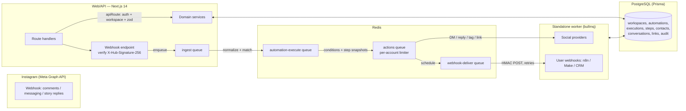

# Architecture

OpenDM is a deliberately boring three-tier system: **Next.js app (web + API)**, **PostgreSQL (state)**, **Redis + BullMQ (asynchrony)**, with a **standalone worker process** doing all retryable work.

## Domains

| Domain | Responsibility |
| --- | --- |
| `auth` | magic-link login, hashed sessions, cookies, CSRF token |
| `workspaces` | tenant model: members, roles, invites, slug |
| `providers` | `SocialProvider` interface, registry, OAuth, token lifecycle (encrypt/refresh/revoke/health) |
| `instagram` | Meta Graph client, webhook parser (comments/DM/story), mock provider |
| `automations` | CRUD, duplicate, archive, export/import (versioned JSON), templates |
| `engine` | conditions evaluation, variable rendering, execution pipeline, status resolution |
| `contacts` | mini-CRM: upsert, tags, notes, timeline |
| `inbox` | conversations, messages, messaging-window verdicts |
| `links` | tracked redirects, click accounting, destination validation |
| `analytics` | SQL aggregates over executions/messages/clicks |
| `webhooks` | outbound delivery records (HMAC, retries, logs) |
| `queue` | BullMQ topology + job payload types |
| `worker` | processors for all four queues |
| `ai` | provider abstraction + feature prompts + usage ledger |
| `audit` | append-only audit trail |
| `templates` | 10 starter automations |
| `billing-placeholder` | `Workspace.plan` + settings — reserved for Stripe |

## Event → Conditions → Actions

1. Meta posts an event → `/api/webhooks/instagram` verifies the signature and enqueues an **ingest** job (200 returned immediately).
2. The worker parses the payload into normalized `NormalizedEvent`s (provider-agnostic) and resolves the owning workspace via the connected account.
3. `runAutomationsForEvent` finds ACTIVE automations whose trigger type matches. Each candidate gets an **execute** job with a composite idempotency key `(providerEventId:automationId)`.
4. `createAndRunExecution` evaluates all conditions (keywords, exclusions, post match, follower gate). Failure ⇒ an observable `SKIPPED` execution. Success ⇒ execution + per-action step rows are created, action jobs enqueued (with BullMQ `delay` honouring the action's delayMs).
5. Action jobs run in the worker: DM / tracked-link DM (mock or Meta), public comment reply, tag contact, webhook scheduling, wait. Steps record attempts/errors; `finalizeExecution` derives the run status: `COMPLETED | PARTIALLY_COMPLETED | FAILED | SKIPPED`.

## Idempotency & replay

- Executions have `@@unique([provider, providerEventId])` — Meta redelivers a
  webhook, the unique key already exists, and the duplicate is dropped.
- Worker step processors check `COMPLETED/SKIPPED` before re-running.
- Outbound webhook deliveries carry an idempotency header (`X-Leonyx-Idempotency-Key = delivery id`).

## Failure handling

- Ingest/execute: limited attempts with exponential backoff, then retention
  in the failed set (30 days) for observability.
- Actions: 3 attempts; the step stays `FAILED` with the provider error; the
  execution resolves to `PARTIALLY_COMPLETED` if earlier actions succeeded.
- Webhook deliveries: 5 attempts, exponential backoff, `nextAttemptAt` + full
  delivery log; non-2xx and timeouts persist the error (never the secret).

## Data model highlights

Every tenant table carries `workspaceId` and is reached through membership
checks. Key tables: `User/Session/LoginToken`, `Workspace/WorkspaceMember/Invite`,
`SocialConnection` (encrypted tokens), `Automation` + `AutomationCondition` +
`AutomationAction`, `Contact` + `ContactTag`, `Conversation/Message`,
`Execution/ExecutionStep`, `TrackedLink/LinkClick`, `WebhookDelivery`,
`Interaction` (timeline), `AuditLog`, `AIUsage`.

Soft delete: automations use `archivedAt`; contacts keep history. Cascades
are intentional: deleting a workspace cascades its data; deleting a
connection never deletes message history (SetNull).

## Observability

- Structured JSON logs with `requestId`, `executionId`, `workspaceId`,
  `automationId`, `jobId` correlation context.
- `/api/health` reports app, DB, Redis and worker heartbeat (freshness).
- Execution pages show trigger payload, per-step status/attempts/errors,
  durations and webhook delivery outcomes.